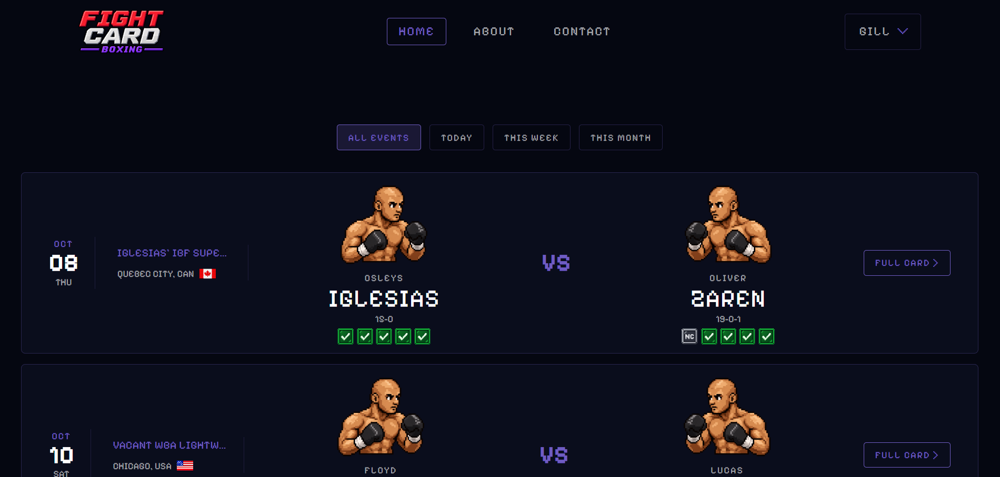
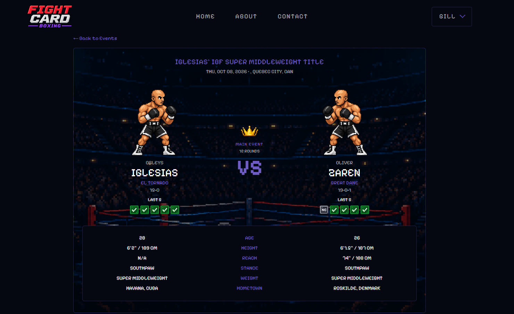
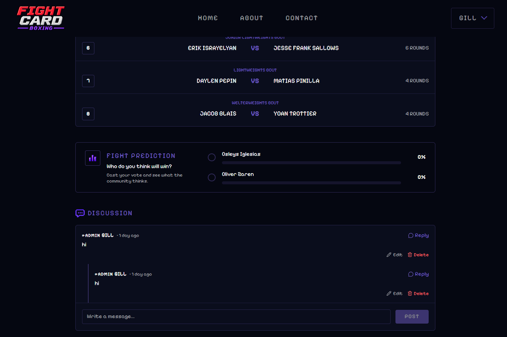

# 🥊 FIGHTCARD

FIGHTCARD is a full-stack boxing platform that allows fans to view upcoming main events from across the world of boxing.

Users can register accounts, make predictions, and participate in discussions by posting comments under each fight.

The site combines boxing information with a retro, video-game-inspired aesthetic, using pixel-art fighter sprites and icons to give the feel of a classic fighting game.

Note: FIGHTCARD is still in beta, and the collection of custom fighter sprites is extremely limited. As a result, vast majority of fighters use a default sprite, with new custom sprites being added periodically.

---

## 🌍 Live Deployment

🔗 https://fightcard.win/

---

## 🚀 Deployment Stack

- **Frontend:** Cloudflare (React application)
- **Backend:** Render (Laravel API)
- **Database:** Render (PostgreSQL)

---

## 🎨 Design Approach

FIGHTCARD was designed around a retro video-game aesthetic, inspired by classic fighting games. Rather than using conventional fighter photographs and standard interface icons, the site uses pixel-art fighter sprites and icons to create a more distinctive visual identity.

The aim was to make browsing boxing events feel more engaging, while keeping the interface straightforward and easy to navigate.

Many existing websites that display upcoming boxing events can feel visually dated or difficult to navigate. FIGHTCARD was built to provide a simpler way for fans to find upcoming fights and access relevant information, without sacrificing personality or visual appeal.

---

## 🧠 Key Features

- 🥊 Upcoming boxing main events
- 🗂️ Fight and fighter information
- 👤 Custom user registration and login system
- 📧 Email verification
- 🔒 Only verified users can participate in discussions and predictions
- 💬 Commenting and discussion section under each fight
- 📊 Fight prediction system with live percentage breakdowns
- 📩 Contact form powered by Formspree
- 🎮 Pixel-art fighter sprites and icons
- 📱 Mobile-responsive interface

---

## 🥊 Fight Information & Community Features

### 🗓️ Upcoming Events

- Users can browse upcoming main events from across the world of boxing.
- Each fight has its own page containing relevant event and fighter information.
- Fight and fighter information is stored separately from user-generated content.

---

### 📊 Predictions

- Users can vote for which fighter they think will win.
- Prediction percentages update to reflect the votes received.
- Users must have a verified email address to participate.

---

### 💬 Discussions

- Each fight has its own discussion section.
- Registered users can post comments and replies.
- Users must verify their email address before participating.
- Users can edit and delete their own comments.

---

### 🔐 Authentication

- Users can register and log in using their email and password.
- Email verification is handled through Laravel and Resend.
- Only verified accounts can submit predictions or participate in discussions.

---

### 📩 Contact Form

- Users can contact me through the contact page.
- The form is powered by Formspree.
- Intended for reporting bugs, incorrect information, or general enquiries.

---

## 📸 Screenshots

### 🏠 Homepage

### 🥊 Fight Page

### 💬 Fight Discussion

---

## 🛠 Tech Stack

### Frontend

- React (Vite)
- TypeScript
- React Router
- TanStack Query
- Tailwind CSS
- Hosted on **Cloudflare**

---

### Backend

- Laravel API
- Laravel Sanctum (SPA authentication)
- Email verification using Resend
- Hosted on **Render**

---

### Database

- PostgreSQL
- Hosted on **Render**

---

## 🏗 Architecture & Design

FIGHTCARD follows a decoupled frontend–backend architecture, separating the presentation layer, application logic, and persistent user data.

The **React frontend** handles the user interface, navigation, fight browsing, predictions, and discussions. It communicates with the Laravel API for authentication and user-generated content.

### 📂 Static Boxing Data

One of the main architectural decisions was to store boxing data, such as fights and fighter profiles, in JSON files rather than relying on the database.

This approach was chosen for a few reasons:

- **Easy configuration and maintenance:** Fight and fighter information can be updated directly through JSON files without requiring database changes.
- **Simple backups:** The data is stored in version-controlled files, making it straightforward to back up and restore.
- **Availability:** The site's main purpose is to allow users to find upcoming fights and relevant information. Keeping this data separate from the backend means that the core browsing experience can remain available even if the backend or database becomes temporarily unavailable.

This separation means the database is primarily responsible for data that needs to be dynamic, such as user accounts, predictions, and comments.

### 🔐 Backend Responsibilities

The **Laravel API** handles functionality that requires persistent user data and server-side validation, including:

- User registration and login
- Session authentication through Laravel Sanctum
- Email verification
- Creating and managing comments
- Recording fight predictions
- Returning prediction totals and percentages

Authentication and authorisation are enforced on the backend, ensuring that only verified users can submit comments or predictions.

This keeps the frontend focused on presentation while the backend manages user data and access control.

---

## 💡 Why This Project?

FIGHTCARD was built to provide a more engaging and accessible way for boxing fans to follow upcoming events.

The idea came from the experience of using existing boxing event websites, which can often feel difficult to navigate or lack a distinctive visual identity. I wanted to create something that made finding fights and viewing fighter information straightforward, while introducing a retro video-game aesthetic that makes the experience more enjoyable.

Beyond the design, the project gave me the opportunity to build a full-stack application with separate frontend and backend deployments, authentication, email verification, and user-generated content.

A key focus was also making deliberate architectural decisions. By keeping relatively static boxing information in JSON files and using the database for dynamic user data, the application avoids making its core browsing experience entirely dependent on backend availability.

---

## 🔮 Future Improvements

Potential improvements for FIGHTCARD include:

- Introducing an automated boxing data source to reduce the need for manual updates, possibly using the Boxing Data API.
- Improving discussion features with additional moderation tools.
- Introducing user profiles and prediction history.

---

## 🧾 License

This project is for portfolio and educational purposes.
